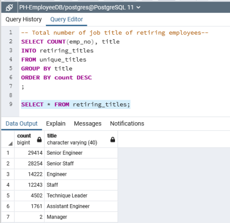
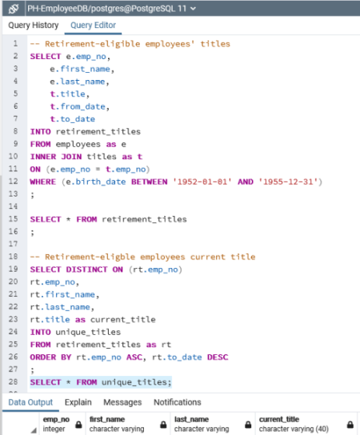
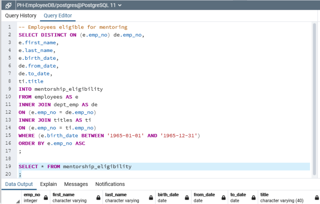
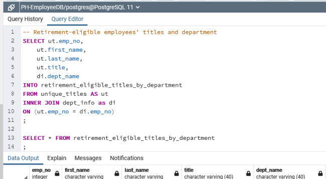

# Pewlett Hackard Work Force Analysis

>Analyze the employee data to help prepare Pewlett Hackard managers for the wave of employees reaching retirement age and recommend strategies to not only mitigate the loss of skills and historical knowledge but also to be able to proactively maintain project productivity by initiating an employee mentorship program. 

### RESULTS 
The analysis resulted in determining the number of retirement-eligible Pewlett Hackard employees by title of their current role, and also identifying the next generation of Pewlett Hackard employees who are eligible to participate in a mentorship program.

---

### Workforce Planning
By determining the number of roles held by retirement-eligible employees, we see at a glance which roles will need to be filled in the next few years.  

### Employee Mentoring Program

Identifying retirement-eligible employees by titles of their current role, we are able to select from this pool of employees to  recruit to serve as mentors in the employee mentorship program. 

 Providing department managers a list of current employees eligible to participate in the employee mentorship program by their current role to identify which employees should be paired with a mentor based on employees current skill level and goals.

## SUMMARY: 
---

There are 90,398 Pewlett Harckard positions that will need to be filled as the "silver tsunami" begins to make an impact over the next few years. Giving managers a list of potential retirees in their department provides a means to proactively reach out for those employees wishing to transition out of their responsibilities an opportunity to participate in the employee mentorship program.

[Back To The Top](#pewlett-hackard-work-force-analysis)
